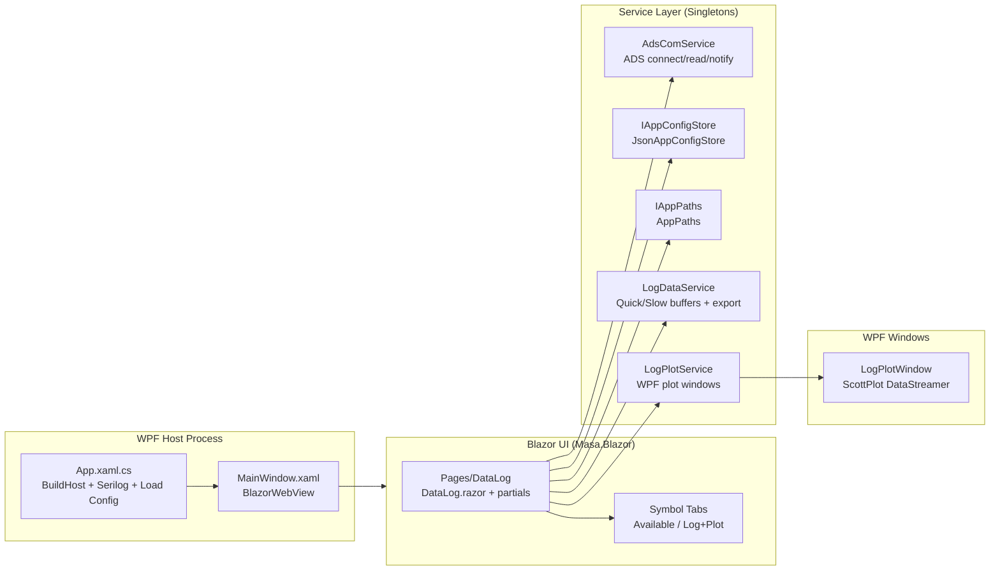

# TwinCAT Dashboard – App Architecture & Data Logging Notes

This document is a practical map of the codebase (WPF + Blazor Hybrid) and a detailed description of the **Data Log** feature, with extra notes for **1ms cyclic ADS notifications**.

## High-Level Architecture

The app is a WPF desktop process that hosts a Blazor UI inside `BlazorWebView`. A .NET Generic Host provides dependency injection, logging, and app services.



## Project Layout (What Goes Where)

Core project is `TwincatDashboard/TwincatDashboard.csproj` (WPF + Razor/Blazor Hybrid). Tests are in `TwincatDashboard.Tests/`.

```text
TwincatDashboard/
  App.xaml.cs                     WPF startup + IHost + Serilog + config load
  MainWindow.xaml(.cs)            WPF window hosting BlazorWebView
  _Imports.razor                  Shared Razor usings

  Pages/
    DataLog/
      DataLog.razor               Page markup (tabs, injects, child components)
      DataLog.razor.cs            UI state + wiring (partial class)
      DataLog.Symbols.cs          Symbol discovery + indexing (partial class)
      DataLog.Logging.cs          Start/stop + ADS notifications + slow timer (partial class)
      DataLogAvailableSymbolsTab.razor  Available symbol selection table
      DataLogLogSymbolsTab.razor        Log/plot selection + start/stop switch

  Services/
    AdsComService.cs              ADS connect + read/write + notifications (+ Ex variants)
    LogDataService.cs             Channel management, buffering, export (csv/mat)
    LogPlotService.cs             Plot window lifecycle + data forwarding
    Configuration/
      IAppConfigStore.cs          Config store interface
      JsonAppConfigStore.cs       JSON persistence
      IAppPaths.cs                Path contract (config/log/temp)

  Models/
    AppConfig.cs                  AdsConfig + LogConfig
    SymboInfo.cs                  SymbolInfo (UI flags: log/quick/plot chain)

  Windows/
    LogPlotWindow.xaml(.cs)       ScottPlot DataStreamer window (50ms refresh timer)

  doc/
    PROJECT_DESIGN.md             High-level design doc
    DESIGN_NOTES.md               Tactical notes
```

## Composition Root (Startup Sequence)

Entry point is WPF `App`:

1. `App.xaml.cs` builds an `IHost` (`Host.CreateApplicationBuilder`) and registers services.
2. Serilog is configured early and installed as the logging provider.
3. Config is loaded once at startup via `IAppConfigStore.LoadAsync()`.
4. `MainWindow` is resolved from DI and shown.
5. `MainWindow.xaml.cs` assigns the DI provider to `BlazorWebView.Services`.

Key file: `TwincatDashboard/App.xaml.cs`.

## Data Log Feature (Detailed)

The Data Log page is currently routed as `@page "/"` and is the primary UI surface.

Key files:

- UI: `TwincatDashboard/Pages/DataLog/DataLog.razor`
- Logic: `TwincatDashboard/Pages/DataLog/DataLog.razor.cs`, `TwincatDashboard/Pages/DataLog/DataLog.Symbols.cs`, `TwincatDashboard/Pages/DataLog/DataLog.Logging.cs`

### Concepts and Modes

- **Available symbols**: leaf PLC symbols discovered via `AdsComService.GetAvailableSymbols(...)`.
- **Log symbols**: symbols where `SymbolInfo.IsLog == true`.
- **Quick log**: high-frequency sampling via ADS device notifications (often `1ms`).
- **Slow log**: lower-frequency polling via a timer and direct reads (`ReadPlcSymbolValueAsync`).
- **Plot**: forwards (downsampled) data to WPF plot windows.

The UI enforces a dependency chain via `SymbolInfo`:

- Setting `IsPlot = true` forces `IsQuickLog = true` and `IsLog = true`.
- Setting `IsQuickLog = true` forces `IsLog = true`.
- Setting `IsLog = false` clears `IsQuickLog` and `IsPlot`.

Key file: `TwincatDashboard/Models/SymboInfo.cs`.

### Symbol Discovery and Indexing

When the user presses refresh in the UI:

1. `DataLog.GetAvailableSymbols()` checks ADS connection state.
2. It loads symbols from configured namespaces (`LogConfig.ReadNamespace`).
3. It merges new symbols (by full name) and sorts them for a stable UI order.
4. It rebuilds a lookup index by full name for fast access.
5. It applies config defaults: `LogSymbols`, `QuickLogSymbols`, and `PlotSymbols`.

Key files:

- `TwincatDashboard/Pages/DataLog/DataLog.Symbols.cs`
- `TwincatDashboard/Services/AdsComService.cs`
- `TwincatDashboard/Models/AppConfig.cs` (`LogConfig`)

Specific note:

- The symbol index (`_availableSymbolsByFullName`) is rebuilt by swapping the dictionary reference, so slow-log reads can use it without locking.

### Start Logging (What Happens Internally)

Trigger: UI switch binds to `StartLogging` and calls `SetLoggingStateAsync(true)`.

High-level sequence:

1. Persist current selection to config (`ConfigStore.SaveAsync()`).
2. Reset plot windows and in-memory channels.
3. Register slow-log channels and start the slow timer.
4. Register quick-log ADS notifications.
5. Open plot windows for selected plot symbols.
6. Subscribe the ADS notification handler.

Key file: `TwincatDashboard/Pages/DataLog/DataLog.Logging.cs`.

### Quick Log Pipeline (1ms-Ready)

Quick log uses **ADS notifications** and is designed to keep the callback extremely small.

Registration:

- Uses `AdsComService.AddDeviceNotificationEx(...)` (TwinCAT `TryAddDeviceNotificationEx`) and subscribes to `AdsNotificationEx`.
- Passes a per-symbol `NotificationTarget` via the ADS `UserData` field.
- Stores created notification handles in `_notificationHandles` for deterministic cleanup.

Callback (`AdsNotificationExHandler`):

- Casts `e.UserData` to `NotificationTarget`.
- Decodes `e.Data.Span` to a `double` using a precomputed decoder.
- Writes the sample into the per-symbol `LogDataChannel` (in-memory buffer).
- Optionally forwards samples to plot with downsampling.

Primitive-only constraint (important):

- Only these managed types are supported for quick log: `bool`, `byte`, `sbyte`, `short`, `ushort`, `int`, `uint`, `long`, `ulong`, `float`, `double`.
- Unsupported types are skipped during registration with a warning.

Key files:

- `TwincatDashboard/Pages/DataLog/DataLog.Logging.cs`
- `TwincatDashboard/Services/AdsComService.cs`

### `LogDataChannel` Storage Strategy (Keep File Open)

Each quick-log symbol has a `LogDataChannel`:

- Writes samples into an in-memory `CircularBuffer<double>`.
- When the buffer reaches a threshold, it copies a chunk to an ArrayPool-rented array and queues it for flushing.
- A background worker flushes queued chunks to disk using a **single long-lived `FileStream`** per channel.
- Writes are batched into an internal `64KB` byte buffer to avoid per-sample `WriteAsync` calls.

Key file: `TwincatDashboard/Services/LogDataService.cs`.

Specific notes:

- Temp file path is under `IAppPaths.TempDirectory` and per channel is `_` + symbol full name + `.csv`.
- `LogDataService.FlushAllChannelsAsync()` is called during stop to ensure exports see all samples.

### Slow Log Pipeline

Slow log is intentionally “not hot path”:

- A `System.Timers.Timer` ticks at `LogConfig.SlowLogPeriod`.
- On each tick, it reads each registered slow symbol via `AdsComService.ReadPlcSymbolValueAsync(...)`.
- Results are appended to `LogDataService.SlowLogDict`.

Key file: `TwincatDashboard/Pages/DataLog/DataLog.Logging.cs`.

Specific notes:

- A `SemaphoreSlim` gate prevents overlapping slow ticks.
- Slow log always includes `AdsConstants.TaskCycleCountName` to help align and debug sessions.

### Stop Logging, Export, and Plot Review

Stop sequence is designed to avoid races and partial exports:

1. Cancel current session (`_loggingCts.Cancel()`).
2. Unsubscribe ADS notification handlers.
3. Remove device notifications by handle.
4. Stop slow timer and wait for any in-flight slow tick.
5. Flush quick-log channels to disk.
6. Load channel data back into arrays from temp files.
7. Export to `csv` and/or `mat` based on `LogConfig.FileType`.
8. If plot symbols exist, display full session data in plot windows.
9. Clear slow-log memory and delete temp files.

Key files:

- `TwincatDashboard/Pages/DataLog/DataLog.Logging.cs`
- `TwincatDashboard/Services/LogDataService.cs`
- `TwincatDashboard/Services/LogPlotService.cs`
- `TwincatDashboard/Windows/LogPlotWindow.xaml.cs`

Specific notes:

- Export uses the minimum data length across channels (`DataLength`) to align rows between channels.
- Plot windows render the “full data” view after stop using `SignalConst(...)` (not the streaming view).

### Plotting Notes (Performance / UX)

Plot windows are WPF windows using ScottPlot `DataStreamer`.

- Streaming view updates are timer-driven (`50ms`) inside `LogPlotWindow`.
- The data log pipeline down-samples plot updates (default target ~100Hz) so UI won’t compete with 1ms logging.

Key file: `TwincatDashboard/Windows/LogPlotWindow.xaml.cs`.

## Operational Notes and Constraints

- For 1ms cyclic logging, the ADS callback must remain synchronous and minimal.
- If you log 50–100 symbols at 1ms, the effective ingest rate is 50k–100k samples/sec.
- Export to CSV is inherently expensive; the design avoids formatting on the ADS callback and pushes it into background flush + stop/export phases.
- The app uses singletons for ADS, logging, config, and plotting services; component teardown (`IAsyncDisposable`) is responsible for clean stop.

## Data Logging Optimizations (What Was Done and Why)

This section describes the concrete optimizations implemented to make **1ms cyclic** logging practical (50–100 primitive scalar symbols).

### Goals

- Make the ADS notification callback O(1), synchronous, and allocation-free.
- Push expensive work (formatting, disk I/O, UI) off the callback thread.
- Keep stop/export deterministic (no partial exports, no races).

### Optimizations by Area

**ADS notification path (quick log)**

- Switched to `AdsNotificationEx` and `TryAddDeviceNotificationEx(...)`.
- A per-symbol `NotificationTarget` is passed via ADS `UserData`.
- The callback reads `e.UserData` directly instead of performing handle→dictionary→symbol lookups.

Files:

- `TwincatDashboard/Services/AdsComService.cs`
- `TwincatDashboard/Pages/DataLog/DataLog.Logging.cs`

**Primitive-only decoding (no boxing / reflection)**

- The decoder is computed once per symbol at start and stored in `NotificationTarget`.
- Decoding uses `BinaryPrimitives` (little-endian). Supported types: `bool`, `byte`, `sbyte`, `short`, `ushort`, `int`, `uint`, `long`, `ulong`, `float`, `double`.
- Non-primitive types are skipped (warning) rather than falling back to slow conversions.

File:

- `TwincatDashboard/Pages/DataLog/DataLog.Logging.cs`

**No per-sample `Task` allocation**

- The ADS callback is synchronous and does not `await` or `Task.Run(...)`.
- This prevents a 1ms callback from creating 1000+ tasks/sec per symbol.

File:

- `TwincatDashboard/Pages/DataLog/DataLog.Logging.cs`

**Channel lookup removal (store channel directly)**

- During start, each quick-log symbol is assigned a `LogDataChannel` and stored in `NotificationTarget`.
- The callback writes directly to `target.Channel.Add(...)` instead of routing through `LogDataService` dictionaries.

Files:

- `TwincatDashboard/Services/LogDataService.cs`
- `TwincatDashboard/Pages/DataLog/DataLog.Logging.cs`

**Keep temp file open per channel (reduce OS/file overhead)**

- Each `LogDataChannel` opens one long-lived `FileStream` on construction.
- Flush workers append to the same stream for the full session.

File:

- `TwincatDashboard/Services/LogDataService.cs`

**Batch disk writes (reduce syscalls)**

- Flush worker formats rows into a reusable `64KB` byte buffer and writes in chunks.
- This avoids issuing a `WriteAsync(...)` call per individual sample line.

File:

- `TwincatDashboard/Services/LogDataService.cs`

**Background flushing**

- The hot path only enqueues chunks (ArrayPool-rented), then returns.
- A background worker flushes queued chunks asynchronously.

File:

- `TwincatDashboard/Services/LogDataService.cs`

**Plot downsampling**

- Plot updates are downsampled (default target ~100Hz) to keep UI/plot from competing with logging.
- Plot window rendering refresh remains timer-driven (`50ms`) inside `LogPlotWindow`.

Files:

- `TwincatDashboard/Pages/DataLog/DataLog.Logging.cs`
- `TwincatDashboard/Windows/LogPlotWindow.xaml.cs`

**Deterministic stop/export**

- Stop cancels, unsubscribes handlers, removes notifications, stops timers, and waits for in-flight slow ticks.
- Quick-log channels are flushed (`FlushAllChannelsAsync`) before loading/exporting.

File:

- `TwincatDashboard/Pages/DataLog/DataLog.Logging.cs`

## Troubleshooting (Data Log)

### Symptom: “Logging misses samples” or channels have different lengths

- Check `LogConfig.QuickLogPeriod` and the PLC task cycle time.
- Expect that **CSV export length** is aligned by using the minimum `DataLength` across channels.
- If a channel is shorter, likely causes:
- Notification not registered for that symbol.
- Unsupported type skipped.
- Storage pipeline falling behind for that channel.

Where to look:

- App logs (Serilog rolling file) for warnings about unsupported types or failed notification registration.
- `LogDataChannel` log output around buffer flush.

### Symptom: “CPU is high during logging”

- Reduce plot load by lowering `targetPlotHz` in `ComputePlotDownsampleFactor(...)`.
- Reduce plot load by disabling plot for high-rate sessions.
- Reduce symbol count.
- Prefer `mat` export for long sessions, or export CSV only when needed.

### Symptom: “Stop takes a long time”

- Stop includes flushing queued quick-log chunks to disk.
- Stop includes loading all quick-log channel files back into memory.
- Stop includes exporting CSV/MAT.
- For long sessions with many symbols, the load+export step will dominate.

Recommended checks:

- Inspect temp directory size (`IAppPaths.TempDirectory`).
- Consider increasing `BufferCapacity` in `LogDataService` to reduce flush frequency.

### Symptom: “Plot windows lag or freeze”

- Plot is intentionally decoupled from logging; if UI lags, downsample plot further.
- Plot is intentionally decoupled from logging; if UI lags, reduce the number of plot channels.
- Plot is intentionally decoupled from logging; if UI lags, keep logging running but only show full data after stop.

## Related Docs

- `TwincatDashboard/doc/PROJECT_DESIGN.md`
- `TwincatDashboard/doc/DESIGN_NOTES.md`
